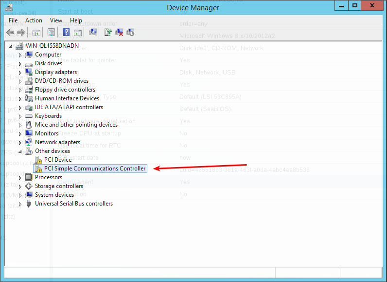
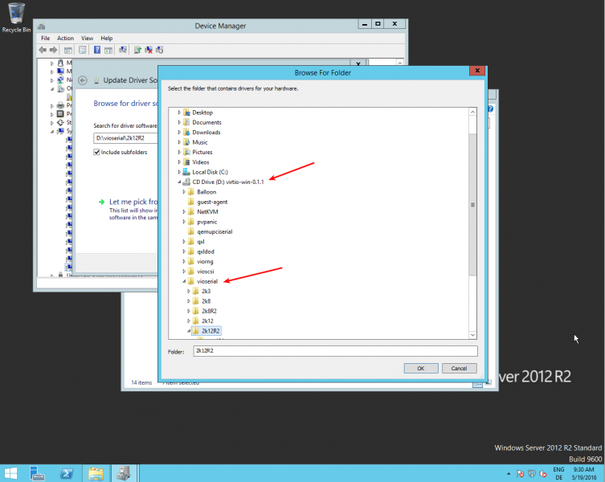
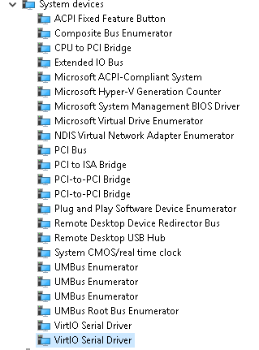
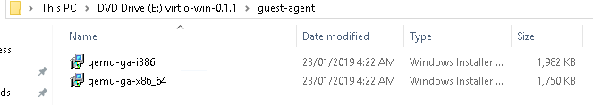
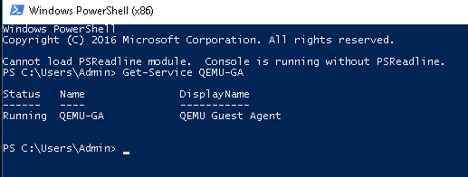

# How to Setup Proxmox and Qemu in Windows 10.

My particular use case for having Qemu setup, is so I can make use of Proxmox backup shceduling.
All my VM's need to run Qemu to do this, without errors.

This is a brief guide to downloading, installing, and testing it on a Windows 10 VM.

## Downloading.

For my use case, I need to install the virtio-drivers for windows, as well as the Qemu-guest agent.

A proxmox read-up on installing Qemu can be found [here](https://pve.proxmox.com/wiki/Qemu-guest-agent)

More information on the virtio-drivers are linked in the article [here](https://pve.proxmox.com/wiki/Windows_VirtIO_Drivers).

The fedora page documenting the different builds and ISO's can be found [here](https://docs.fedoraproject.org/en-US/quick-docs/creating-windows-virtual-machines-using-virtio-drivers/index.html)

Direct download link to stable release/build:
[Download](https://fedorapeople.org/groups/virt/virtio-win/direct-downloads/stable-virtio/virtio-win.iso)

In your Winodws VM, download the ISO.
Proceed to Mount it in windows.

## Installing.

Open up device manager. 

Find the new device called **"PCI Simple Communications Controller"** under **"Other devices"**

Right click and **Update Driver**, then locate the Mounted ISO, open the **vioserial** folder, and find the folder that matches your version of Winows running on the VM. Run throught the installer.



This should now add the shown virtio-drivers in device manager.



Now you can install the **Qemu-agent**. Simply go to the **guest-agent** folder on the ISO and run that installer.



## Testing.

Now that everything is installed, we can test from in powershell.

Open **powershell** under admin.

Type in the command:

``` powershell
Get-Service QEMU-GA
```

This should return a result like below if installed correctly.

